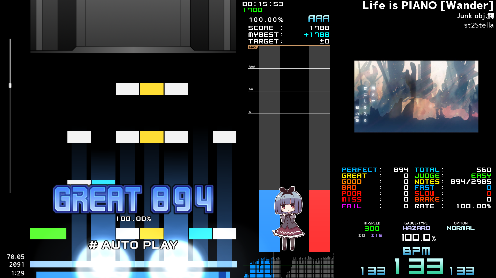
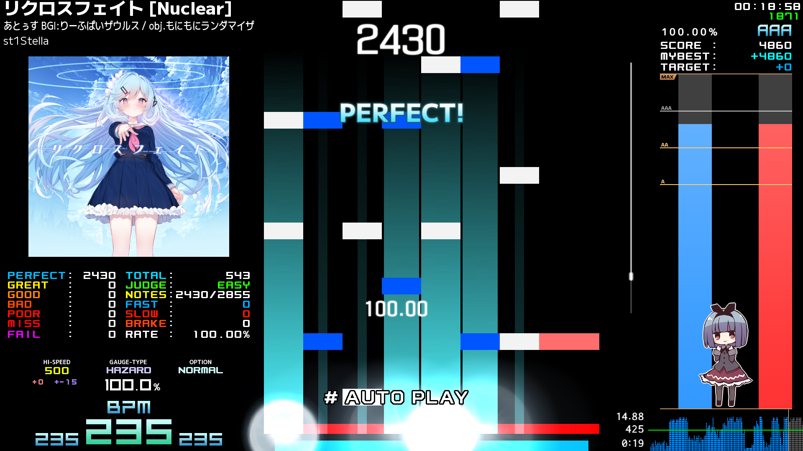
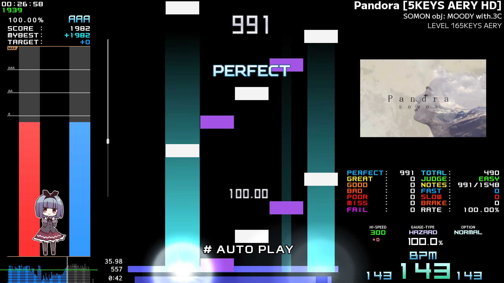
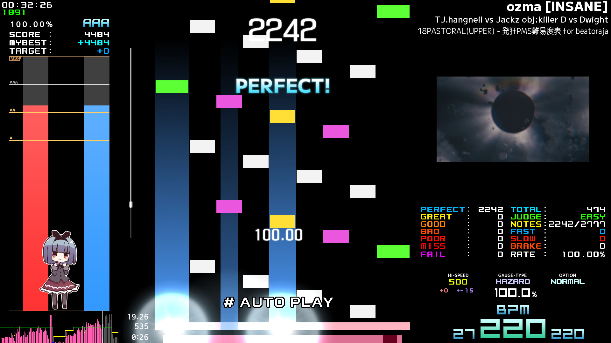

# Rm-skin
##### This is simple dark skin for beatoraja inspired by Retsukiya's "R-skin".

## Features
- This skin is equivalent to the **"R-skin"** standard.
- **The width and height of notes** can be changed freely.
- **The size and color scheme of the bombs** can be freely changed.
- **The Fast/Slow threshold** (the interval in milliseconds during which Fast/Slow is hidden) can be freely changed.
- In addition to **7-key**, **5-key** and **9-key** are supported.

## About Licenses
- Files with the prefix "!" : ["Creative Commons Attribution-NonCommercial-NoDerivatives 4.0 International (CC BY-NC-ND 4.0)"](https://creativecommons.org/licenses/by-nc-nd/4.0/deed.en "CC BY-NC-ND 4.0")
   - "Rm-skin-main/!_common/..."
     - ".../!_alt_image.png"
     - ".../!_info_system.png"
     - ".../!_play_system.png"
     - ".../!_score_system.png"
   - "Rm-skin-main/parts/!_bomb/..."
     - ".../!_x150%_Aqua_clear_ring_SCUROed.png"
     - ".../!_x150%_Blue_clear_ring_SCUROed.png"
     - ".../!_x150%_Purple_clear_ring_SCUROed.png"
     - ".../!_x150%_Red_clear_ring_SCUROed.png"
     - ".../!_x150%_White_clear_ring_SCUROed.png"
     - ".../!_x150%_Yellow_clear_ring_SCUROed.png"
     - ".../!_x150%_Aqua_ECFN_Default.png"
     - ".../!_x150%_Blue_ECFN_Default.png"
     - ".../!_x150%_Purple_ECFN_Default.png"
     - ".../!_x150%_Red_ECFN_Default.png"
     - ".../!_x150%_White_ECFN_Default.png"
     - ".../!_x150%_Yellow_ECFN_Default.png"
   - "Rm-skin-main/parts/!_mascot/..."
     - ".../!_Default.png"
     - ".../!_Default_Inverted.png"
- Other Files : ["GNU General Public License v3.0 (GPLv3)"](https://choosealicense.com/licenses/gpl-3.0/ "GPLv3")
- Also, please refer to the license included with the fonts for information on font handling.
   - "Rm-skin/font/LICENSE_..."

## [Sample Movie](https://www.youtube.com/watch?v=UInLj27s08A "Sample Movie")
\* This Sample Movie is an early version. Some of them may differ from the current specifications.

## Sample Picture

